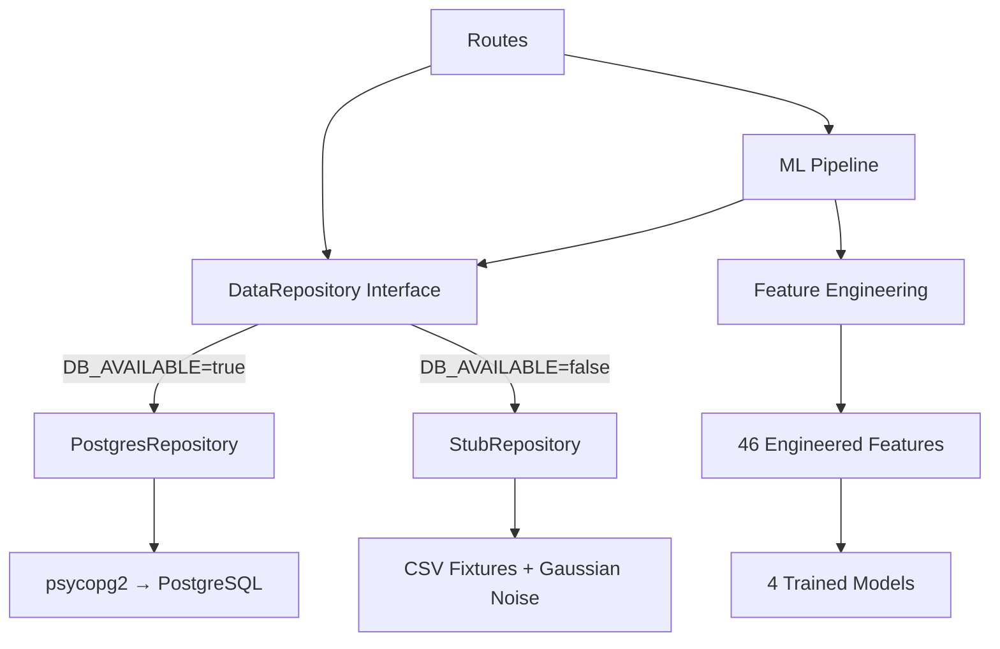

# AIAP ML Engine — Implementation Walkthrough

## Overview

Fixed **22 bugs** (8 critical syntax errors, 7 functional defects, 7 architectural gaps), created **7 new files**, and rewrote **6 existing files** to produce a fully functional ML backend that:

- Compiles and starts cleanly with 7 API routes
- Runs in **Demo Mode** using fixture CSVs when PostgreSQL is unavailable
- Trains 4 ML models via **Synthetic Supervisor** pattern
- Generates per-ATM predictions with health scores, failure probabilities, activity levels, and cash depletion forecasts
- Produces alert codes matching the `Prototype_V2.jsx` frontend format

---

## Files Changed

### New Files (7)

| File | Purpose |
|------|---------|
| [config.py](file:///c:/Users/JT/Downloads/Capstone/BckND/AIAP_BckND/config.py) | Central config with `DB_AVAILABLE` flag, path constants, noise params |
| [.env.example](file:///c:/Users/JT/Downloads/Capstone/BckND/AIAP_BckND/.env.example) | Template documenting all environment variables |
| [utils/repository.py](file:///c:/Users/JT/Downloads/Capstone/BckND/AIAP_BckND/utils/repository.py) | Smart Stub DataRepository with Gaussian noise + PostgresRepository |
| [ml_engine/pipeline.py](file:///c:/Users/JT/Downloads/Capstone/BckND/AIAP_BckND/ml_engine/pipeline.py) | Training + inference + alert generation pipeline |
| [ml_engine/__init__.py](file:///c:/Users/JT/Downloads/Capstone/BckND/AIAP_BckND/ml_engine/__init__.py) | Package init |
| [routes/__init__.py](file:///c:/Users/JT/Downloads/Capstone/BckND/AIAP_BckND/routes/__init__.py) | Package init |
| [scripts/generate_fixtures.py](file:///c:/Users/JT/Downloads/Capstone/BckND/AIAP_BckND/scripts/generate_fixtures.py) | Generates fixture CSVs from JSX ATM_DATA |

### Rewritten Files (6)

| File | Key Changes |
|------|-------------|
| [app.py](file:///c:/Users/JT/Downloads/Capstone/BckND/AIAP_BckND/app.py) | Fixed `pd` import, added CORS, added `/api/v1/auth/login` route |
| [utils/db.py](file:///c:/Users/JT/Downloads/Capstone/BckND/AIAP_BckND/utils/db.py) | MockConnection stub when DB unavailable |
| [utils/auth.py](file:///c:/Users/JT/Downloads/Capstone/BckND/AIAP_BckND/utils/auth.py) | Added `@wraps`, env-based credentials |
| [ml_engine/feature_engineering.py](file:///c:/Users/JT/Downloads/Capstone/BckND/AIAP_BckND/ml_engine/feature_engineering.py) | Fixed all 7 issues, added 5 missing derived columns |
| [ml_engine/models.py](file:///c:/Users/JT/Downloads/Capstone/BckND/AIAP_BckND/ml_engine/models.py) | Fixed syntax error in `CASH_FEATURES`, removed invalid `random_state` |
| [routes/data_ingest.py](file:///c:/Users/JT/Downloads/Capstone/BckND/AIAP_BckND/routes/data_ingest.py) | Fixed `filename` syntax error, repository pattern |
| [routes/public.py](file:///c:/Users/JT/Downloads/Capstone/BckND/AIAP_BckND/routes/public.py) | Fixed malformed dict, corrected `cash_level` formula |
| [routes/staff.py](file:///c:/Users/JT/Downloads/Capstone/BckND/AIAP_BckND/routes/staff.py) | Fixed SQL typo, repository pattern, added alerts |

### Generated Data

| File | Content |
|------|---------|
| `data/raw/atm_fixture_master.csv` | 6 ATMs metadata |
| `data/raw/atm_fixture_daily_metrics.csv` | 180 rows (6 ATMs × 30 days) |
| `data/raw/atm_fixture_maintenance_logs.csv` | 6 maintenance records |
| `ml_engine/saved_models/*.joblib` | 4 trained models |

---

## Architecture: DB Abstraction Layer



Switching to PostgreSQL requires **one change**: set `DB_AVAILABLE=true` in `.env`.

---

## API Routes & Frontend Contract

| Route | Method | Frontend Component |
|-------|--------|--------------------|
| `/api/v1/auth/login` | POST | `Login` component |
| `/api/v1/public/atms` | GET | `CustomerView` ATM list |
| `/api/v1/public/atms/<id>` | GET | `CustomerView` detail panel |
| `/api/v1/staff/dashboard/kpis` | GET | `OpsDashboard` overview KPIs |
| `/api/v1/staff/fleet/health` | GET | `OpsDashboard` fleet table |
| `/api/v1/data/upload/metrics` | POST | CSV upload + retrain |
| `/health` | GET | System health check |

### Cash Level Convention (Q4 Resolution)
- **`cash_stress_indicator`** (0–1): internal ML feature. Higher = worse.
- **`cash_level`** in API response: `(1 - cash_stress_indicator) × 100`. Higher = better = more cash remaining. Matches frontend `cashLevel` field.

---

## ML Pipeline: Synthetic Supervisor

The training pipeline implements the user-specified **Synthetic Supervisor** pattern:

1. **Pseudo-labels** computed from PDF Section 2.4 deterministic formulas
2. **Gaussian noise injection** (σ=2.5 for health, σ=0.5 for cash depletion)
3. **2% label flipping** on failure binary targets
4. **Time-Series Split** cross-validation (adaptive `n_splits`)
5. **Automatic fallback** to real labels from `data/processed/training_labels.csv` when available

### Feature Importances (from training run)
| Feature | Importance |
|---------|------------|
| error_count_7d | 0.321 |
| days_since_maintenance | 0.232 |
| uptime_percentage | 0.229 |
| transaction_velocity | 0.177 |
| maintenance_count_30d | 0.041 |

> [!NOTE]
> The negative R² (-11.97) is expected with only 186 training rows and synthetic targets. This will improve significantly with real historical data from the PostgreSQL database.

---

## Verification Results

| Check | Result |
|-------|--------|
| py_compile (13 files) | ALL COMPILED OK |
| Import resolution | ALL IMPORTS OK |
| Feature engineering | 186 rows → 46 columns |
| Model training | 4 models saved to `saved_models/` |
| Per-ATM prediction | All 6 ATMs return valid predictions |
| Alert generation | ATM-004: `OUT_OF_SERVICE, MAINTENANCE_OVERDUE, ERROR_SPIKE` |
| Flask app startup | 7 routes registered |

### Sample Predictions
```
ATM-001 (Library):       health=54.0, fail=3.5%, activity=Moderate, depletion=2.9d
ATM-002 (Student Union): health=44.4, fail=0.5%, activity=High,     depletion=0d
ATM-003 (Med Sciences):  health=51.8, fail=0.3%, activity=Moderate, depletion=0d
ATM-004 (Admin Block):   health=23.8, fail=1.5%, activity=Low,      depletion=43.9d [OUT_OF_SERVICE]
ATM-005 (Sports):        health=49.1, fail=7.1%, activity=High,     depletion=0d
ATM-006 (Canteen):       health=50.4, fail=0.7%, activity=High,     depletion=0d
```

---

## Next Steps (When PostgreSQL is Available)

1. Copy `.env.example` to `.env` and set `DB_AVAILABLE=true` + `DATABASE_URL`
2. Run database migrations to create `atm_master`, `atm_daily_metrics`, and `maintenance_logs` tables
3. Upload real operational CSVs via `POST /api/v1/data/upload/metrics`
4. Optionally provide `data/processed/training_labels.csv` for supervised training
5. Connect `Prototype_V2.jsx` to the live API endpoints instead of static `ATM_DATA`
